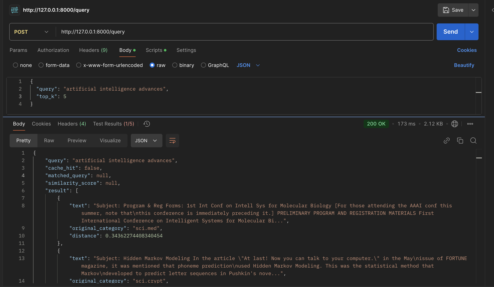
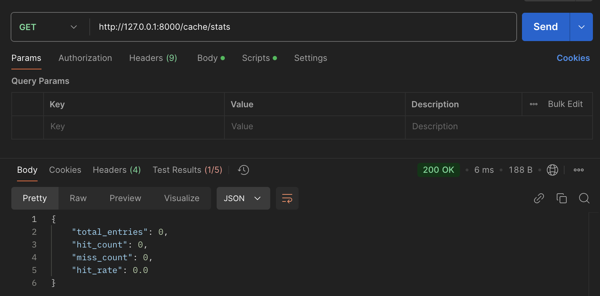
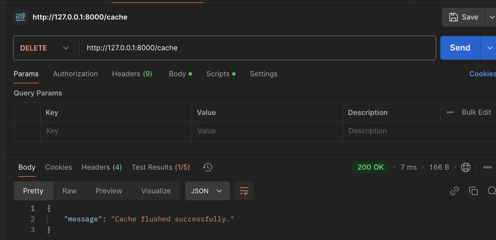
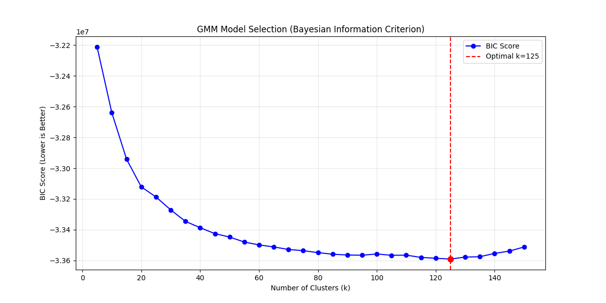
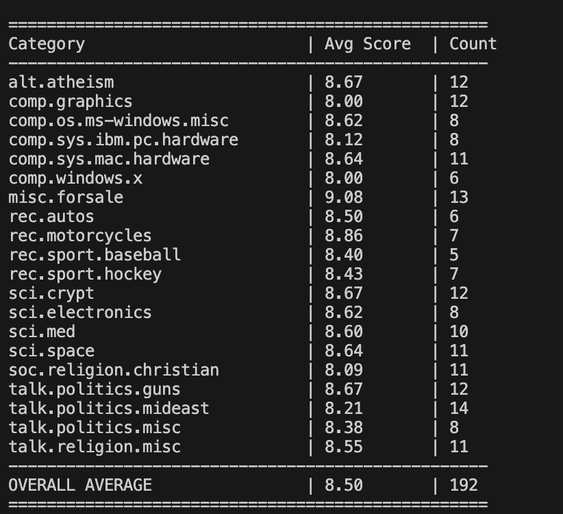

# Trademarkia Semantic Search API

Trademarkia Semantic Search API is a robust, high-performance semantic search pipeline and FastAPI application designed to efficiently retrieve and cache queries over the 20 Newsgroups corpus. This project leverages state-of-the-art natural language processing techniques, including the BAAI/bge-small-en-v1.5 embedding model, to provide accurate and context-aware search results. By implementing advanced retrieval strategies such as fuzzy clustering for data organization and semantic caching for optimized query response times, the system ensures high throughput and low latency. Built with a modern stack featuring ChromaDB for vector storage and FastAPI for the web interface, it provides a scalable solution for complex text retrieval tasks.

## Setup and Installation

1. **Clone the repository and set up a virtual environment:**
   ```bash 
   python3 -m venv .venv
   source .venv/bin/activate  
   ```

2. **Install the dependencies:**
   Ensure you have all required libraries installed. Typical requirements include:
   ```bash
   pip install -r requirements.txt
   ```

## Running the Pipeline (Data Preparation)

To initialize the database, train the models, and prepare the embeddings from scratch, run the scripts in the `pipeline/` directory in the following order:

1. **Clean and Preprocess the Data:**
   Strips noise, standardizes question/answer formats, and saves cleaned text to `data/complete_preprocessing/`.
   ```bash
   cd pipeline
   python process_all.py
   ```

2. **Generate Vector Embeddings:**
   Loads the BAAI/bge-small-en-v1.5 model and generates normalized vector embeddings for the cleaned documents.
   ```bash
   python vector_store.py
   ```

3. **Train the Fuzzy Clusters (GMM):**
   *(Note: Make sure ChromaDB is running or setup script is adjusted if it expects the DB first. Normally, load data to ChromaDB first, then extract to cluster, or vice versa depending on your architecture).* 
   To set up the Chroma Database with the embeddings, run:
   ```bash
   python setup_chromadb.py
   ```
   Then, train the Gaussian Mixture Model to tag documents with their dominant clusters:
   ```bash
   python clustering.py
   ```


## Running the API Service

### Option 1: Using Docker Compose (Recommended)

The easiest way to run the service is using Docker. The provided `docker-compose.yml` builds the FastAPI service and mounts the localized `chroma_db/` directory so data remains persistent.

1. **Start the containers** in detached mode:
   ```bash
   docker compose up -d
   ```
2. **Stop the containers**:
   ```bash
   docker compose down
   ```

The API will be accessible at `http://localhost:8000`.

### Option 2: Running Locally natively
If you prefer running the uvicorn server directly on your host machine:

```bash
uvicorn app.main:app --host 0.0.0.0 --port 8000
```


## API Endpoints

Once the application is running, you can access the automatically generated interactive API documentation at:
- **Swagger UI**: `http://localhost:8000/docs`
- **ReDoc**: `http://localhost:8000/redoc`

### Core Endpoints:

- `POST /query`: Submits a semantic search query.
  **Request Body**:
  ```json
  {
    "query": "artificial intelligence advances",
    "top_k": 5
  }
  ```
  
- `GET /cache/stats`: Returns current real-time statistics of the cluster-aware semantic cache.

- `DELETE /cache`: Flushes the entire in-memory cache and resets stats.


---

## Architecture Overview

The system is broken down into distinct stages:
1. **Data Preprocessing**: Cleans the raw text data by removing noise, metadata, and routing lines, while correctly chunking and categorizing Question vs Monologue formats.
2. **Vectorization**: Converts the cleaned documents into dense 384-dimensional vector embeddings using the lightweight `BAAI/bge-small-en-v1.5` model.
3. **Fuzzy Clustering (GMM)**: Evaluates the embeddings using a Gaussian Mixture Model with 125 clusters to probabilistically map documents to specific topic buckets. 
4. **Vector Database Engine**: Stores the documents, metadata (including cluster data), and embeddings inside a persistent local **ChromaDB**.
5. **Cluster-Aware Semantic Caching**: A custom, in-memory caching system that intercepts incoming queries, maps them to their GMM cluster, and serves cached responses if the similarity > 0.86.
6. **API Layer**: Exposes the query endpoint and cache management routes utilizing **FastAPI**.
---
## 📁 Repository Structure

```text
.
├── app/
│   ├── main.py                # FastAPI Server & Routes
│   ├── cache_logic.py         # ClusterAwareSemanticCache implementation
│   └── models/                # Saved models (e.g., GMM pickle files)
├── data/                      # Data storage (Raw, Processed, ChromaDB output)
├── pipeline/
│   ├── preprocessing.py       # Functions to clean 20_newsgroups noise
│   ├── process_all.py         # Batch runner for the preprocessing
│   ├── vector_store.py        # Embeds the corpus using SentenceTransformers
│   ├── clustering.py          # Trains GMM and injects fuzzy distributions into ChromaDB
│   └── setup_chromadb.py      # Initialize and persist documents/embeddings to ChromaDB
├── experiments/
│   ├── find_optimal_clusters.py # Calculates absolute minimum BIC score (k=125)
│   ├── profile_clusters.py      # Analyzes how original categories group within clusters
│   ├── analyze_lengths.py       # Validates the 512-token limit of the BGE model
│   └── cluster_retrieval.py     # Tests cluster-filtered context queries 
└── tests/
    ├── test_preprocess.py       # Automated testing for preprocessing 
    ├── evaluate_preprocessing.py# Uses an LLM (Phi-3 via Ollama) to score cleaning quality
    └── test_retrieval.py        # Validates base ChromaDB similarity search
```
---
## Key Technologies & Design Choices

### 1. BGE-Small Embedding Model
The `BAAI/bge-small-en-v1.5` model was chosen because it outputs 384-dimensional vectors, making it highly optimal for lightweight, asymmetric semantic search setups. 

### 2. Gaussian Mixture Model (GMM) Clustering
Using Bayesian Information Criterion (BIC), the optimal number of clusters (`k`) was statistically mapped to `125`. Injecting this `dominant_cluster` into ChromaDB's metadata allows the search space to be immediately narrowed down significantly, acting as an extreme performance optimizer.



### 3. Cluster-Aware Semantic Cache
Implemented internally (`app/cache_logic.py`), this intelligently stores prior queries based on vector similarity.
- **Cache Hit**: Skips database IO and model inference for similar or paraphrased questions.
- **Cache Miss**: Drops down to ChromaDB, filtering strictly by the `dominant_cluster` dynamically predicted by the GMM.

### 4. LLM-Evaluated Preprocessing
The pipeline uses a local LLM (Microsoft's Phi-3 via Ollama) to autonomously sample and "grade" the noise-stripping operations of the preprocessing engine.



## Testing and Experiments

To replicate or review the model architectures, run the specific files inside the `experiments/` and `tests/` directories. Note that `evaluate_preprocessing.py` requires an active, local `ollama` instance hosting the `phi3` model.

